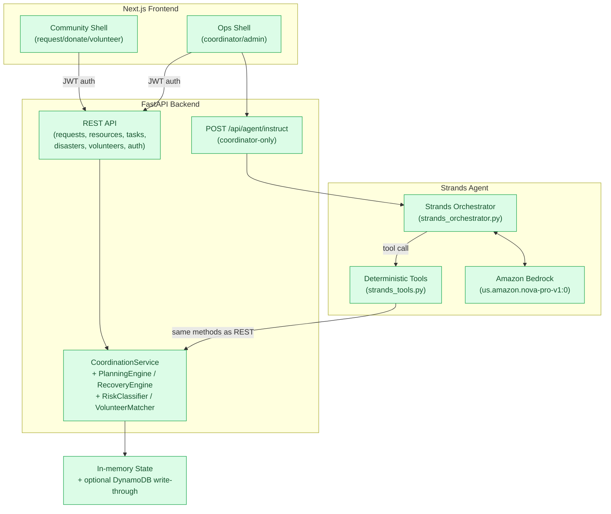

# AWS Architecture

## Current Architecture (Implemented)

This is what actually runs today, not the production target further below.

Key points this diagram reflects:

- The Strands agent never bypasses backend rules — every tool in `strands_tools.py` is a thin wrapper calling the same `CoordinationService` methods the REST API uses, so RBAC/region/allocation/lifecycle validation applies identically whether a coordinator clicks a button or types an instruction.
- There is no tool for RED-tier actions; AMBER outcomes always create a pending `Decision` requiring separate human approval — the agent cannot approve its own AMBER actions.
- If Bedrock is unreachable, `run_instruction` falls back to keyword-matched deterministic tool calls (`run_fallback_instruction`) rather than fabricating a response.
- AgentCore Runtime, EventBridge, SNS/SES, and CloudWatch (below, under "Production Target") are **not** deployed — this is a local/single-account deployment with optional DynamoDB persistence, not the production target architecture.

## Local Development

- FastAPI runs locally or in Docker.
- DynamoDB Local stores operational data.
- LocalStack may emulate S3, SNS, EventBridge, IAM, and STS.
- Strands model provider can be mock/local for deterministic tests.
- Dashboard notifications are sufficient for MVP volunteer alerts.
- File-based session storage may be used locally under `agent_sessions/`.

Current caveat: `docker-compose.yml` references a frontend container, but `frontend/Dockerfile` and `frontend/package.json` do not exist yet.

## Production Target

- Amazon Bedrock AgentCore Runtime hosts the Strands agent service.
- Amazon Bedrock provides the foundation model.
- DynamoDB stores shared normal/disaster entities, events, alerts, tasks, decisions, and audits.
- EventBridge triggers planning, disaster dispatch, volunteer response, timeout, and recovery workflows.
- AgentCore Memory stores durable operational preferences only.
- S3 stores large audit artifacts, exported demo/evaluation reports, and optional session artifacts.
- SNS/SES sends volunteer alerts and coordinator decision notifications when enabled.
- CloudWatch receives logs, metrics, alarms, and traces where supported.

## AgentCore Runtime Notes

For HTTP runtime deployment, the container must:

- listen on port `8080`
- implement `/ping`
- implement `/invocations`
- return structured success/error responses
- log correlation IDs for every request

The existing FastAPI app currently defaults to port `8000`; production AgentCore packaging must adapt this.

Reference:

- AgentCore Runtime HTTP protocol contract: https://docs.aws.amazon.com/bedrock-agentcore/latest/devguide/runtime-http-protocol-contract.html

## EventBridge Flows

Normal Mode:

- inventory/request/volunteer events trigger planning or recovery
- validated GREEN assignments execute
- AMBER decisions notify coordinator
- RED actions are blocked and audited

Disaster Mode:

- admin-created disaster event triggers Sentinel
- affected-zone and need events trigger volunteer matching
- volunteer alert response events trigger task assignment scoring
- timeout/decline/cancellation/route closure/resource loss events trigger Recovery Agent

## DynamoDB

Initial table set should evolve from current code direction:

- `Users`
- `Organizations`
- `Inventory`
- `Requests`
- `Volunteers`
- `Tasks` or generalized `DeliveryAssignments`
- `DisasterEvents`
- `VolunteerAlerts`
- `Events`
- `Decisions`
- `StrandsAuditLogs`

Production pass should review access patterns before adding GSIs.

## Observability

CloudWatch metrics:

- autonomous decisions count
- human escalations count
- RED blocks count
- volunteer alerts sent
- volunteer accept/decline/timeout counts
- task assignment success
- validation failures count
- planning duration
- recovery duration
- assignments preserved ratio
- unmet disaster needs
- unsafe autonomous actions

Structured logs should include `correlation_id`, `operating_mode`, `disaster_id`, `event_id`, `task_id`, `decision_id`, `agent_name`, `tool_name`, `risk_class`, and validation outcome.
